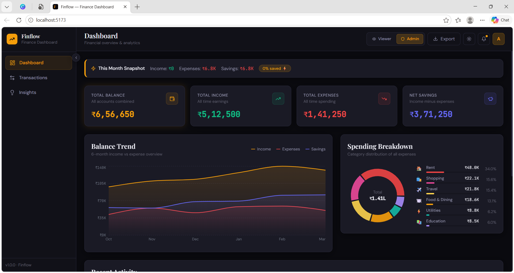
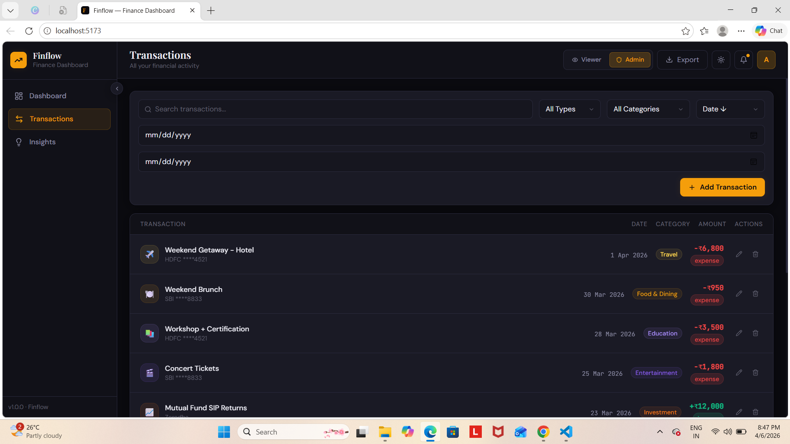
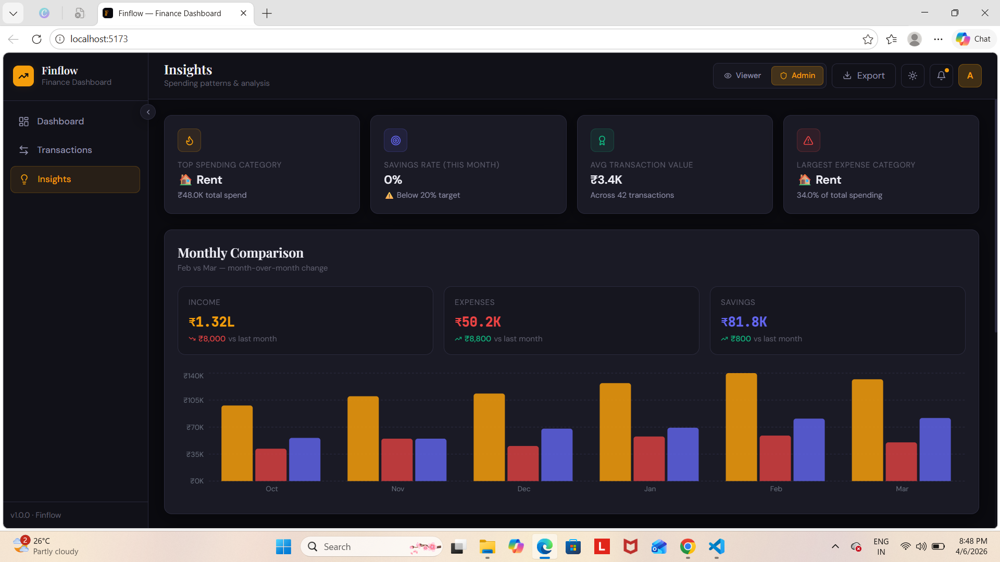
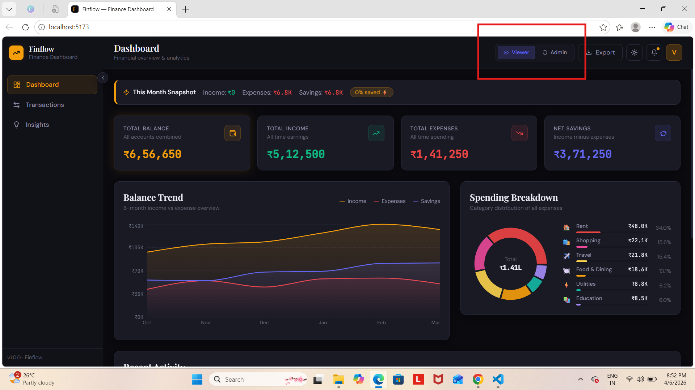

# Finflow — Finance Dashboard

<div align="center">

**A clean, modern personal finance dashboard built with React.**  
Track income, expenses, insights, and spending patterns — all in one place.

</div>

---

## 📸 Screenshots

### 🏠 Dashboard Overview

> Summary cards with animated counters, 6-month trend chart, spending donut breakdown, and recent activity.

---

### 💳 Transactions

> Paginated transaction list with search, filters by type/category/date, sorting, and admin edit/delete actions.

---

### 💡 Insights

> Monthly comparison chart, top spending category, savings rate, and full category deep-dive with progress bars.

---

### 🔐 Role Switcher

> Toggle between Viewer (read-only) and Admin (full CRUD) directly from the header.

---

## 🚀 Live Demo

👉 **[Click here to view the live demo](https://finflow-fianance-dashboard.netlify.app)**

---

## ✨ Features

| Feature | Description |
|--------|-------------|
| 📊 Dashboard | Summary cards, area trend chart, donut chart, recent transactions |
| 💳 Transactions | Search, filter, sort, paginate, add/edit/delete (admin only) |
| 💡 Insights | Monthly comparison, savings rate, category breakdown |
| 🔐 Role-Based UI | Viewer vs Admin roles with different permissions |
| 🌙 Dark / Light Mode | Toggle with persistence across sessions |
| 💾 Local Storage | Data persists on page refresh via Zustand persist |
| 📤 Export | Download transactions as CSV or JSON |
| 📱 Responsive | Works on mobile, tablet, and desktop |

---

## 🛠️ Tech Stack

| Tool | Purpose |
|------|---------|
| **React 18** | UI framework |
| **Zustand** | State management with persistence |
| **Recharts** | Area, bar, and donut charts |
| **Tailwind CSS 3** | Utility-first styling |
| **date-fns** | Date formatting |
| **Lucide React** | Icons |
| **Vite** | Build tool |

---

## ⚡ Getting Started

### Prerequisites
- Node.js v18+
- npm or yarn

### Installation

```bash
# 1. Clone the repository
git clone https://github.com/YOUR_USERNAME/finance-dashboard.git

# 2. Navigate into the project
cd finance-dashboard

# 3. Install dependencies
npm install

# 4. Start the development server
npm run dev
```

Open [http://localhost:5173](http://localhost:5173) in your browser.

### Build for Production

```bash
npm run build
npm run preview
```

---

## 📁 Project Structure

```
finance-dashboard/
├── public/
│   └── favicon.svg
├── screenshots/              ← Add your screenshots here
│   ├── banner.png
│   ├── dashboard.png
│   ├── transactions.png
│   ├── insights.png
│   └── roles.png
├── src/
│   ├── components/
│   │   ├── layout/           # Sidebar, Header
│   │   ├── dashboard/        # SummaryCards, BalanceTrend, SpendingBreakdown
│   │   └── transactions/     # TransactionFilters, TransactionList, TransactionModal
│   ├── context/
│   │   └── store.js          # Zustand global store
│   ├── data/
│   │   └── mockData.js       # 42 mock transactions + monthly data
│   ├── pages/
│   │   ├── DashboardPage.jsx
│   │   ├── TransactionsPage.jsx
│   │   └── InsightsPage.jsx
│   ├── utils/
│   │   └── helpers.js        # Formatting + export utilities
│   ├── App.jsx
│   ├── main.jsx
│   └── index.css
├── .gitignore
├── index.html
├── package.json
├── tailwind.config.js
└── vite.config.js
```

---

## 🔐 Role System

Switch roles instantly using the toggle in the top header bar:

| Role | Permissions |
|------|-------------|
| 👁️ **Viewer** | View dashboard, browse transactions, see insights |
| 🛡️ **Admin** | All viewer permissions + Add, Edit, Delete transactions |

---

## 📊 Mock Data

The app ships with **42 realistic transactions** across 4 months including:
- 💼 Salary & freelance income
- 🍽️ Food, transport, shopping, utilities
- ✈️ Travel, entertainment, education
- 📈 Investment returns

All amounts are in **Indian Rupees (₹)**.

---

## 🙌 Acknowledgements

- [Recharts](https://recharts.org) — Composable chart library
- [Zustand](https://zustand-demo.pmnd.rs) — Lightweight state management
- [Lucide](https://lucide.dev) — Beautiful open-source icons
- [Tailwind CSS](https://tailwindcss.com) — Utility-first CSS framework

---

<div align="center">

Made with ❤️ using React + Tailwind CSS

</div>
